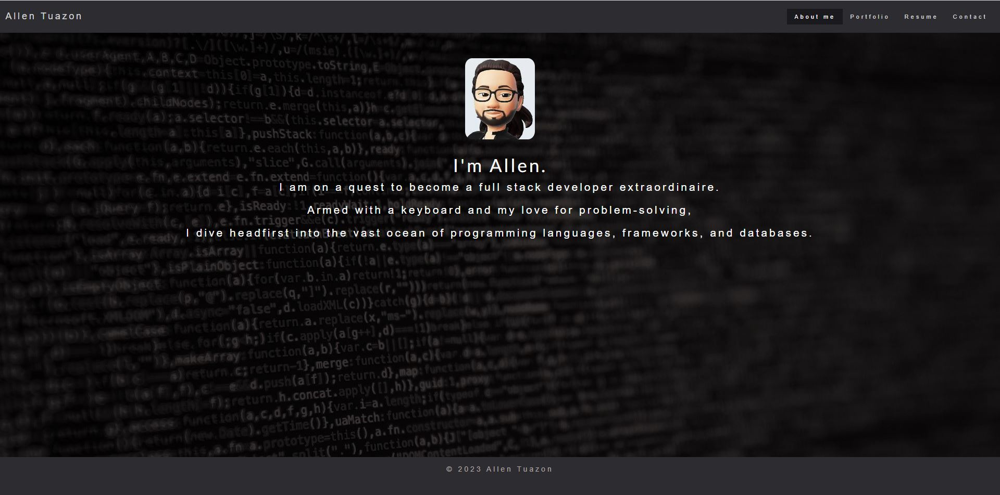

# my-react-portfolio

## Description

This program is my own personal portfolio that is built using reactjs.

This will be a living website that I will continually update as I progress through my full stack developer career.

## Table of Contents
- [Installation](#installation)
- [Usage](#usage)
- [Screenshot](#screenshot)
- [Video recording](#video-recording)
- [Credits](#credits)
- [License](#license)
- [Badges](#badges)
- [Features](#features)
- [Contributing](#contributing)
- [Tests](#tests)
- [Email address](#email-address)
- [Github username](#github-username)

## Installation
Run npm install to install the dependencies.
Run the command **npm start** on the terminal to start the application."

## Usage
The program is deployed to github pages.
URL: https://allentpogi.github.io/my-react-portfolio/

## Screenshot

Below is a screenshot of the applicatione.

## Video recording

There is no video recording for this assignment.

## Credits
none

## License
n/a

## Badges

## Features
This program showcases my full stack developer portfolio and my previous projects.

## Contributing
n/a

## Tests
N/A

## Email address
a.t@gmail.com

## Github username
allentpogi
